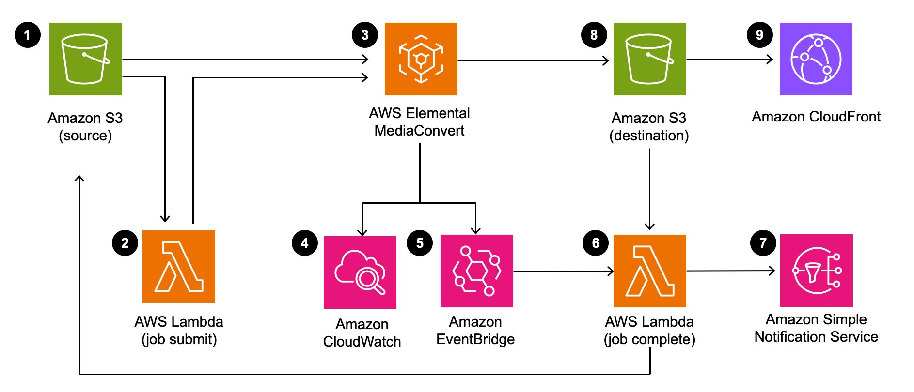

# Video on Demand on AWS Foundation

How to implement a video-on-demand workflow on AWS leveraging AWS Lambda, AWS Elemental MediaConvert, Amazon s3 and Amazon CloudWatch. Source code for [Video on Demand on AWS Foundation](https://aws.amazon.com/solutions/video-on-demand-on-aws/) solution.

## Architecture Overview


The AWS CloudFormation template deploys a workflow that ingests source videos, transcodes the videos into multiple Adaptive Bitrate Formats (ABR) and delivers the content through Amazon CloudFront. The solution creates a source Amazon S3 bucket to store the source video files, and a destination bucket to store the outputs from AWS Elemental MediaConvert. A  job-settings.json file, used to define the encoding settings for MediaConvert, is uploaded to the source S3 bucket.

The solution includes two AWS lambda functions: a job submit function to create the encoding jobs in MediaConvert and a job complete function to process the outputs. Amazon CloudWatch tracks encoding jobs in MediaConvert and triggers the Lambda job complete function. An Amazon SNS topic is deployed to send notifications of completed jobs, and Amazon CloudFront is configured with the destination S3 bucket as the origin for global distribution of the transcoded video content.

For more detail including using your own settings file please see the [solution implementation guide](https://docs.aws.amazon.com/solutions/latest/video-on-demand-on-aws-foundation/welcome.html)


## Creating a custom build
The solution can be deployed through the CloudFormation template available on the solution home page: [Video on Demand on AWS](https://aws.amazon.com/solutions/video-on-demand-on-aws/).

The solution was developed using the [AWS Cloud Development Kit (CDK)](https://docs.aws.amazon.com/cdk/latest/guide/home.html) and leverage 3 of the [AWS Solutions Constructs](https://docs.aws.amazon.com/solutions/latest/constructs/welcome.html). To make changes to the solution, download or clone this repo, update the source code and then either deploy the solution using the CDK or run the deployment/build-s3-dist.sh script. The build script will generate the CloudFormation template from the CDK source code using cdk synth, run deployment/cdk-solution-helper to update the template to pull the lambda source code from S3 and package the Lambda code ready to be deployed to an Amazon S3 bucket in your account.  

For details on deploying the solution using the CDK see the [CDK Getting Started guide](https://docs.aws.amazon.com/cdk/latest/guide/hello_world.html)


### Prerequisites:
* [AWS Command Line Interface](https://aws.amazon.com/cli/)
* Node.js 12.x or later
* aws-cdk version 1.63.0


### 1. Running unit tests for customization
Run unit tests to make sure added customization passes the tests:
```
cd source/custom-resource
npm install
cd ../job-submit
npm install

# Then go back to deployment directory
cd ../../deployment
chmod +x ./run-unit-tests.sh
./run-unit-tests.sh
```

### 2. Create an Amazon S3 Bucket
The CloudFormation template is configured to pull the Lambda deployment packages from Amazon S3 bucket in the region the template is being launched in. Create a bucket in the desired region with the region name appended to the name of the bucket (e.g. for us-east-1 create a bucket named ```my-bucket-us-east-1```).
```
aws s3 mb s3://my-bucket-us-east-1
```

### 3. Create the deployment packages
Build the distributable:
```
chmod +x ./build-s3-dist.sh
./build-s3-dist.sh my-bucket video-on-demand-on-aws-foundation v1.0.0
```

> **Notes**: The _build-s3-dist_ script expects the bucket name as one of its parameters, and this value should not include the region suffix.

Deploy the distributable to the Amazon S3 bucket in your account:
```
aws s3 cp ./regional-s3-assets/ s3://my-bucket-us-east-1/video-on-demand-on-aws-foundation/v1.0.0/ --recursive --acl bucket-owner-full-control
```

### 4. Launch the CloudFormation template.
* Deploy the cloudFormation template from deployment/global-assets/video-on-demand-on-aws-foundation.template into the same region as you newly created S3 bucket.

## Converting video files
Videos should be uploaded to the newly created S3 bucket folder ```[stack-name]-source[id]/assets01/```. Once the video is converted you'll find the video and poster image here ```[stack-name]-destination[id]/[job-uuid]/```.

***

Copyright Amazon.com, Inc. or its affiliates. All Rights Reserved.

Licensed under the Apache License, Version 2.0 (the "License");
you may not use this file except in compliance with the License.
You may obtain a copy of the License at

    http://www.apache.org/licenses/LICENSE-2.0

Unless required by applicable law or agreed to in writing, software
distributed under the License is distributed on an "AS IS" BASIS,
WITHOUT WARRANTIES OR CONDITIONS OF ANY KIND, either express or implied.
See the License for the specific language governing permissions and
limitations under the License.

This solution collects anonymous operational metrics to help AWS improve the quality of features of the solution. For more information, including how to disable this capability, please see the implementation guide.
